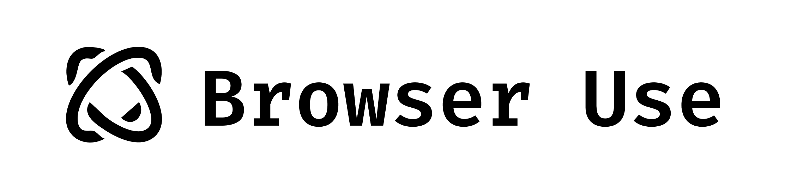

[English](README.md) | 中文

<picture>
  <source media="(prefers-color-scheme: dark)" srcset="./static/browser-use-dark.png">
  <source media="(prefers-color-scheme: light)" srcset="./static/browser-use.png">
  
</picture>

<h1 align="center">让AI掌控你的浏览器 🤖</h1>

[](https://github.com/gregpr07/browser-use/stargazers)
[](https://link.browser-use.com/discord)
[](https://cloud.browser-use.com)
[](https://docs.browser-use.com)
[](https://x.com/gregpr07)
[](https://x.com/mamagnus00)
[](https://app.workweave.ai/reports/repository/org_T5Pvn3UBswTHIsN1dWS3voPg/881458615)

🌐 Browser-use 是连接AI代理与浏览器的最简方式。

💡 在我们的[Discord社区](https://link.browser-use.com/discord)查看他人作品并分享你的项目！想要周边？访问我们的[官方商城](https://browsermerch.com)。

🌤️ 免配置体验 - 立即试用<b>云端托管版</b>浏览器自动化！<b>[立即体验 ☁︎](https://cloud.browser-use.com)</b>。

# 快速开始

使用pip安装（Python>=3.11）：

```bash
pip install browser-use
```

安装playwright：

```bash
playwright install
```

启动你的AI代理：

```python
from langchain_openai import ChatOpenAI
from browser_use import Agent
import asyncio
from dotenv import load_dotenv
load_dotenv()

async def main():
    agent = Agent(
        task="对比GPT-4o和DeepSeek-V3的价格",
        llm=ChatOpenAI(model="gpt-4o"),
    )
    await agent.run()

asyncio.run(main())
```

在`.env`文件中添加API密钥：

```bash
OPENAI_API_KEY=
```

更多配置、模型选择等详细信息，请查阅[文档 📕](https://docs.browser-use.com)。

### 界面测试

可试用[带UI界面的版本](https://github.com/browser-use/web-ui)

或直接运行gradio示例：

```
uv pip install gradio
```

```bash
python examples/ui/gradio_demo.py
```

# 演示案例

<br/><br/>

[任务](https://github.com/browser-use/browser-use/blob/main/examples/use-cases/shopping.py)：将杂货商品加入购物车并结账。

[](https://www.youtube.com/watch?v=L2Ya9PYNns8)

<br/><br/>

提示：将最新LinkedIn关注者添加至Salesforce潜在客户。


<br/><br/>

[提示](https://github.com/browser-use/browser-use/blob/main/examples/use-cases/find_and_apply_to_jobs.py)："阅读我的简历，寻找机器学习岗位，保存至文件，在新标签页中申请，遇到问题及时询问"

https://github.com/user-attachments/assets/171fb4d6-0355-46f2-863e-edb04a828d04

<br/><br/>

[提示](https://github.com/browser-use/browser-use/blob/main/examples/browser/real_browser.py)："在Google Docs中给父亲写感谢信，并保存为PDF"


<br/><br/>

[提示](https://github.com/browser-use/browser-use/blob/main/examples/custom-functions/save_to_file_hugging_face.py)："查找Hugging Face上cc-by-sa-4.0许可的模型，按点赞数排序，保存前五名"

https://github.com/user-attachments/assets/de73ee39-432c-4b97-b4e8-939fd7f323b3

<br/><br/>

## 更多案例

访问[示例目录](examples)获取更多案例，或加入[Discord社区](https://link.browser-use.com/discord)展示你的项目。

# 愿景

告诉计算机你的需求，它就能自动完成。

## 路线图

### 代理功能

- [ ] 增强记忆功能（摘要、压缩、RAG等）
- [ ] 提升规划能力（加载网站上下文）
- [ ] 降低token消耗（系统提示、DOM状态）

### DOM解析

- [ ] 优化日期选择器、下拉菜单等特殊元素处理
- [ ] 改进UI元素状态表示

### 任务重试

- [ ] LLM作为后备方案
- [ ] 创建可定义的工作流模板
- [ ] 返回playwright脚本

### 数据集

- [ ] 创建复杂任务数据集
- [ ] 模型性能基准测试
- [ ] 特定任务模型微调

### 用户体验

- [ ] 人机协同执行
- [ ] 提升GIF生成质量
- [ ] 创建教程、求职、测试等多样化演示

## 贡献指南

欢迎贡献！欢迎提交issue报告问题或功能建议。文档贡献请查看`/docs`目录。

## 本地开发

了解更多开发细节，请查阅[本地配置指南 📕](https://docs.browser-use.com/development/local-setup)。

## 合作计划

我们正在组建UI/UX设计委员会，共同探索软件重设计如何提升AI代理性能，帮助企业在AI时代保持竞争优势。

申请加入委员会请联系[Toby](mailto:tbiddle@loop11.com?subject=I%20want%20to%20join%20the%20UI/UX%20commission%20for%20AI%20agents&body=Hi%20Toby%2C%0A%0AI%20found%20you%20in%20the%20browser-use%20GitHub%20README.%0A%0A)。

## 周边商品

想要展示Browser-use专属周边？访问[官方商城](https://browsermerch.com)。优秀贡献者将获赠免费周边 👀。

## 引用

如果研究或项目中使用了Browser Use，请引用：

```bibtex
@software{browser_use2024,
  author = {Müller, Magnus and Žunič, Gregor},
  title = {Browser Use: Enable AI to control your browser},
  year = {2024},
  publisher = {GitHub},
  url = {https://github.com/browser-use/browser-use}
}
```

 <div align="center">  
 
[](https://x.com/gregpr07)
[](https://x.com/mamagnus00)
 
 </div>

<div align="center">
用❤️打造于苏黎世与旧金山
 </div>