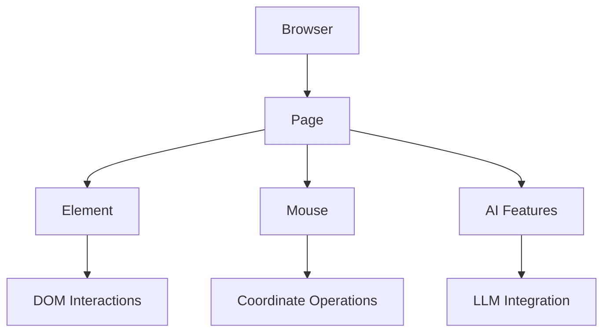

## Core Architecture



### Core Classes

- **Browser** (alias: **BrowserSession**): Main session manager
- **Page**: Represents a browser tab/iframe
- **Element**: Individual DOM element operations
- **Mouse**: Coordinate-based mouse operations

## Basic Usage

```python
from browser_use import Browser, Agent
from browser_use.llm.openai import ChatOpenAI

async def main():
    llm = ChatOpenAI(api_key="your-api-key")
    browser = Browser()
    await browser.start()

    # 1. Actor: Precise navigation and element interactions
    page = await browser.new_page("https://github.com/login")
    email_input = await page.must_get_element_by_prompt("username field", llm=llm)
    await email_input.fill("your-username")

    # 2. Agent: AI-driven complex tasks
    agent = Agent(browser=browser, llm=llm)
    await agent.run("Complete login and navigate to my repositories")

    await browser.stop()
```

## Actor vs WatchDog

- Actor is the low-level browser control API you call directly from your code to open pages, 
find elements, click, type, run JavaScript, and integrate with LLMs. It is request/response style: your code decides
 when to act and awaits each operation.
- WatchDog is a background service that listens on the event bus and reacts to events
 like “type text”, “click element”, or “handle timeout” emitted by higher-level tools or agents.
  It is used to monitor and execute actions in response to events rather than being called directly in most user code.
- When upgrading from v0.5.11 to v0.9.6, new projects and most custom logic should be built on the Actor API
 for direct, Playwright-style control, while existing WatchDog-based handlers can be gradually migrated by moving logic 
 into Actor calls and only keeping WatchDog where you still need event-bus–driven automation.


### Why a separate Actor API?

- Actor provides a focused, Playwright-like surface around Browser, Page, Element and Mouse 
so that low-level interactions stay in one consistent API instead of being spread across many event handlers.
- Older event names such as `on_ClickElementEvent` come from the event-bus tooling layer; Actor re-exposes the same capabilities as
 direct methods on `Page` and `Element` (for example click, fill, evaluate) so you can write and test browser logic without wiring event objects.
- In practice, use Actor for writing new interaction code and keep using WatchDog/event-bus hooks only where you need cross-cutting
 concerns such as monitoring, logging, or reacting to system-level lifecycle events.


## Important Notes

- **Not Playwright**: Actor is built on CDP, not Playwright. The API resembles Playwright as much as possible for easy migration, but is sorta subset.
- **Immediate Returns**: `get_elements_by_css_selector()` doesn't wait for visibility
- **Manual Timing**: You handle navigation timing and waiting
- **JavaScript Format**: `evaluate()` requires arrow function format: `() => {}`


