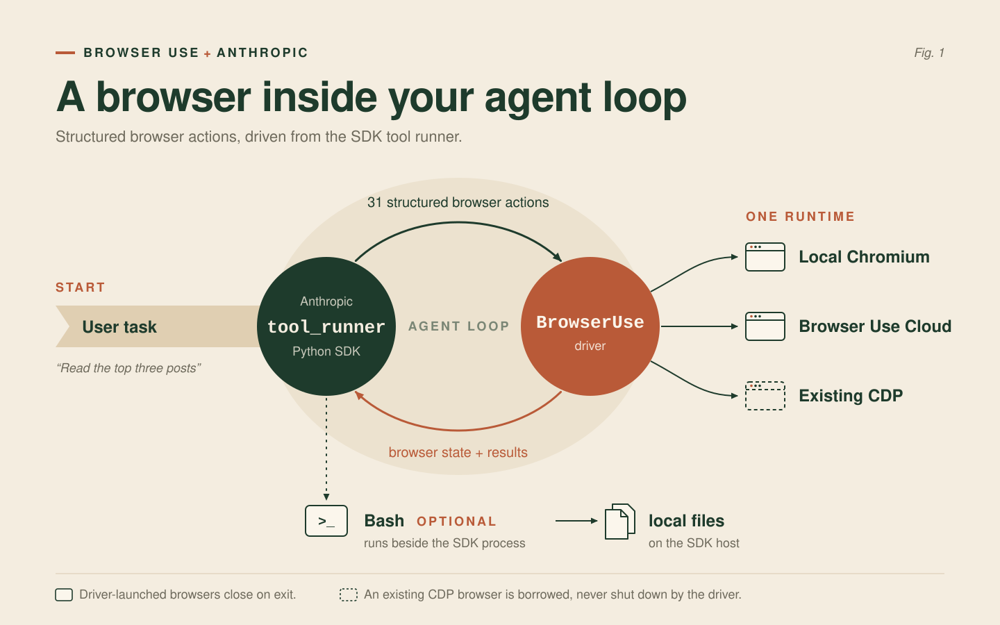

# Anthropic SDK × Browser Use

Browser Use and Anthropic collaborated on this integration so Claude can use
Browser Use as its browser driver. The integration keeps Anthropic's tool
runner and browser-tool contract while Browser Use provides the browser
runtime, all 31 actions, and local or remote execution.



The same program works with three browser runtimes:

| Runtime | Driver | Who starts and stops it? |
| --- | --- | --- |
| Local Chromium | `BrowserUse()` | The driver |
| Browser Use Cloud | `BrowserUse(use_cloud=True)` | The driver |
| Existing local or remote CDP browser | `BrowserUse(session)` | Your application |

## Quickstart

Browser Use requires Python 3.11 or newer. Anthropic's browser toolset requires
the Anthropic SDK release that includes `anthropic.tools.browser` and
`client.beta.messages.tool_runner`.

Create a project and install both packages:

```bash
uv init --python 3.12
uv add browser-use anthropic
uvx browser-use install
```

Set the API key and the model Anthropic documents for the browser toolset:

```bash
export ANTHROPIC_API_KEY=your-key
export ANTHROPIC_MODEL=your-model
# Optional: show Anthropic SDK logs
export ANTHROPIC_LOG=info
```

Save this as `run_browser.py`:

```python
import asyncio
import os
from pathlib import Path

from anthropic import AsyncAnthropic

from browser_use.integrations.anthropic import Bash, BrowserUse


async def main() -> None:
    task = 'Open example.com and save its page title to title.txt.'
    driver = BrowserUse()
    bash = Bash(output_dir=Path('outputs'))

    async with driver, AsyncAnthropic() as client:
        runner = client.beta.messages.tool_runner(
            model=os.environ['ANTHROPIC_MODEL'],
            max_tokens=32_768,
            max_iterations=1_000,
            tools=[driver, bash],
            system=(
                'Complete the task autonomously. Use the browser tools for web '
                'interaction. Use Bash for local computation and files in outputs/.'
            ),
            messages=[{'role': 'user', 'content': task}],
        )
        final = await runner.until_done()

    print('\n'.join(block.text for block in final.content if block.type == 'text'))


if __name__ == '__main__':
    asyncio.run(main())
```

Run it:

```bash
uv run run_browser.py
```

The application owns the driver lifecycle. The `async with driver` block
starts the browser and always closes it when the run ends.

See Anthropic's
[browser-toolset quickstarts](https://github.com/anthropics/claude-quickstarts/tree/main/browser-toolset)
for the SDK concepts and runner behavior.

## Browser Use Cloud

Set `BROWSER_USE_API_KEY`, then change one line:

```python
driver = BrowserUse(use_cloud=True)
```

Create a key at
[cloud.browser-use.com/new-api-key](https://cloud.browser-use.com/new-api-key).
The driver creates a Browser Use Cloud browser, connects to it over CDP, and
stops it when the context exits.

## Existing or remote browser

Pass an already started `BrowserSession` to the driver. Your application keeps
responsibility for that session's lifecycle:

```python
import os

from anthropic import AsyncAnthropic
from browser_use import BrowserSession
from browser_use.integrations.anthropic import Bash, BrowserUse

task = 'Open example.com and report its page title.'
session = BrowserSession(cdp_url=os.environ['BROWSER_USE_CDP_URL'])
await session.start()
driver = BrowserUse(session)
bash = Bash(output_dir='outputs')

try:
    async with driver, AsyncAnthropic() as client:
        runner = client.beta.messages.tool_runner(
            model=os.environ['ANTHROPIC_MODEL'],
            max_tokens=32_768,
            max_iterations=1_000,
            tools=[driver, bash],
            messages=[{'role': 'user', 'content': task}],
        )
        final = await runner.until_done()
finally:
    await session.kill()
```

## What ships in Browser Use

`BrowserUse` implements every member of Anthropic's 31-action browser
toolset:

| Group | Actions |
| --- | --- |
| Navigation and tabs | `navigate`, `new_tab`, `list_tabs`, `switch_tab`, `close_tab` |
| Page state | `screenshot`, `zoom`, `read_page`, `find`, `get_page_text`, `wait` |
| Pointer | `left_click`, `right_click`, `middle_click`, `double_click`, `triple_click`, `hover`, `mouse_move`, `left_mouse_down`, `left_mouse_up`, `left_click_drag`, `scroll`, `scroll_to` |
| Input | `type`, `key`, `hold_key`, `form_input`, `file_upload` |
| Diagnostics | `read_console`, `read_network`, `javascript_exec` |

`Bash` is a separate custom tool for local computation and deliverables. It
runs commands from the configured output directory, strips ambient credentials
from the child environment, caps returned output, applies a timeout, and kills
the process group on timeout:

```python
bash = Bash(
    output_dir='outputs',
    timeout_seconds=120,
    max_output_bytes=50_000,
)
```

The working directory is a boundary for generated files, not an operating
system sandbox. Run the SDK process inside your normal container or sandbox
when tasks may contain untrusted instructions.

## Optional actions and approvals

Anthropic leaves `javascript_exec`, `file_upload`, `read_console`, and
`read_network` disabled by default. Enabling JavaScript or file upload
requires a `confirm` callback. When a callback is present, the SDK calls it
before every browser action, so approve routine actions in code and prompt a
person only for the actions your application treats as sensitive:

```python
async def confirm(context):
	if context.member not in {'javascript_exec', 'file_upload'}:
		return True
	return await app.approve(
		action=context.member,
		tab_id=context.tab_id,
        tab_url=context.tab_url,
    )


driver = BrowserUse(
	confirm=confirm,
	configs={
		'javascript_exec': {'enabled': True},
		'file_upload': {'enabled': True},
		'read_console': {'enabled': True},
		'read_network': {'enabled': True},
	},
)
```

The SDK's URL and file policies remain available through the driver's base
class. Use them to constrain navigation and approved documents.

## Files with remote browsers

`file_upload` works when the resolved file path exists on the browser host.
For a remote browser, provide a `document_resolver` that maps an approved
document ID to a browser-host path:

```python
driver = BrowserUse(
    session,
    document_resolver=lambda document_id: remote_paths[document_id],
    configs={'file_upload': {'enabled': True}},
    confirm=confirm,
)
```

`Bash` runs beside the SDK process, so files it creates are local to that
process. The adapter does not transfer files between the SDK host and a remote
browser host.

## Integration contract

The public integration contains Browser Use code only. It expects Anthropic's
SDK to provide:

- `BetaAsyncAbstractBrowserToolset20260801` and the browser action types
- `client.beta.messages.tool_runner(...)`
- mixed browser-toolset and custom-tool execution through
  `tools=[driver, bash]`
- browser state serialization and the required browser-tool beta header

Browser Use accepts any compatible Anthropic 1.x release. The final launch SDK
version should follow Anthropic's release notes.
